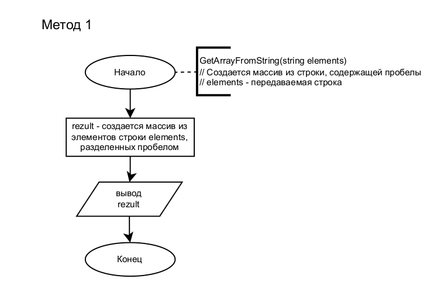
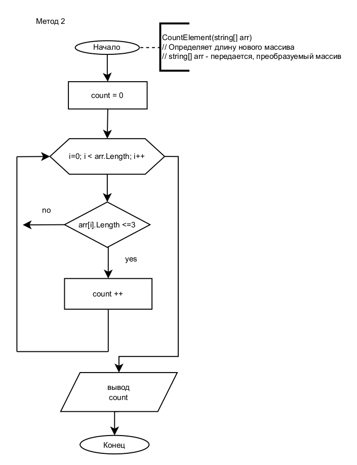
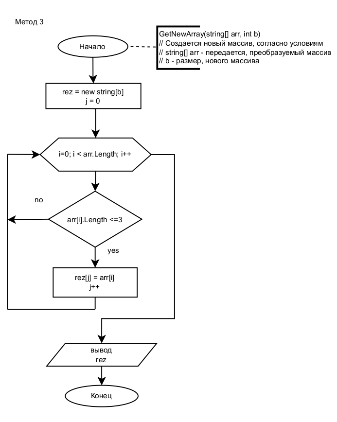
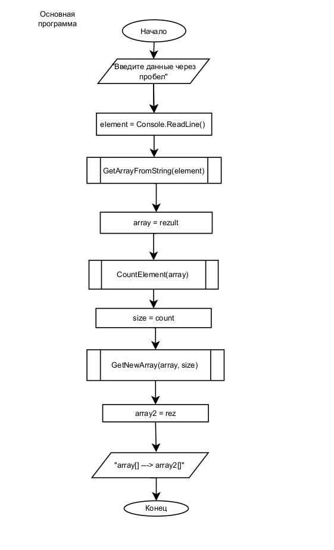

## GB-Final_control_work_on_the_main_block

#### *Задача:*
Написать программу, которая из имеющегося массива строк формирует новый массив из строк, длина которых меньше, либо равна 3 символам. Первоначальный массив можно ввести с клавиатуры, либо задать на старте выполнения алгоритма. При решении не рекомендуется пользоваться коллекциями, лучше обойтись исключительно массивами.

*Примеры:
[“Hello”, “2”, “world”, “:-)”] → [“2”, “:-)”]
[“1234”, “1567”, “-2”, “computer science”] → [“-2”]
[“Russia”, “Denmark”, “Kazan”] → []*

#### *Условия выполнения задачи:*
1. Создать репозиторий на GitHub
2. Нарисовать блок-схему алгоритма (можно обойтись блок-схемой основной содержательной части, если вы выделяете её в отдельный метод)
3. Снабдить репозиторий оформленным текстовым описанием решения (файл README.md)
4. Написать программу, решающую поставленную задачу
5. Использовать контроль версий в работе над этим небольшим проектом (не должно быть так, что всё залито одним коммитом, как минимум этапы 2, 3, и 4 должны быть расположены в разных коммитах)

### *Решение задачи:*

- Описание решения

Решение заключается в том, что не обходимо создать произвольный массив из строк. Проверить в нем длину(размер) каждого элемента(строки). Из элементов, соответствующих условию, создать новый массив. Так же возможно из созданного массива удалять элемент, не соответсвующий требованию. Мы пойдем по первому варианту.

- Блок схема выполнения решения
  созданы блок-схемы методов и основной программы

- Описание методов
  
  1. Метод. Созданние массива. GetArrayFromString(string elements). На вход получает строку, введенную с клавиатуры.

     Данный метод исползуется для создания массива из введенной стороки. Элементами массива являются части строки, разделенные пробелом

     *Пример:* "Мама мыла раму" --> ["Мама", "мыла", "раму"] - получили массив из трех элементов

  2. Метод. Определение длинны нового массива CountElement(string[] arr). На вход получает созданный массив (из метода1)

     Данный метод используется для подсчета количества элементов массива, удовлетворяющих условию. Получаем колличество элементов. Это значение так же используем для определения длины нового массива

  3. Метод. Создание нового массива. GetNewArray(string[] arr, int b) На вход получает Массив строк и число, определяюще длину нового массива (получено из метода2)
     Создается новый новый массив, в который записываются элементы, из полученного массива, удовлетворяющие условию
     

- Результаты выполнения программы.
    Введите строки через пробел: fsdb fb 84av45 5v /*6 15fsv >:) 56
  
    [fsdb, fb, 84av45, 5v, /*6, 15fsv, >:), 56]  --->  [fb, 5v, /*6, >:), 56]

### КОД

using System;

using static System.Console;

/*-----------метод1------созданние массива---------------*/

string[] GetArrayFromString(string elements)

{

    string[] rezult = elements.Split(" ", StringSplitOptions.RemoveEmptyEntries);
    
    return rezult;

}

/*-----------метод3------созданние нового массива---------------*/

string[] GetNewArray(string[] arr, int b)

{
     string [] rez = new string[b] ;
     
     int j = 0;
     
     for (int i = 0; i< arr.Length; i++)
     
     {

         if (arr[i].Length <=3)
         
         {
         
             rez[j] = arr[i];
             
             j++;
         
         }
         
     }
     
     return rez;

}

/*-----------метод2------определение длинны нового массива---------------*/

int CountElement(string[] arr)

{

    int count = 0;
    
    for(int i=0; i < arr.Length; i++)
    
        if (arr[i].Length <=3) count++;
    
    return count;

}

/*-----------Основная программа---------------*/

Clear();

Write("Введите строки через пробел: ");

string element = Console.ReadLine();

string[] array = GetArrayFromString(element);

int size = CountElement(array);

string[] array2 = GetNewArray(array, size);

WriteLine();

Write($"[{String.Join(", ", array)}]  --->  ");

WriteLine($"[{String.Join(", ", array2)}]");

WriteLine();
